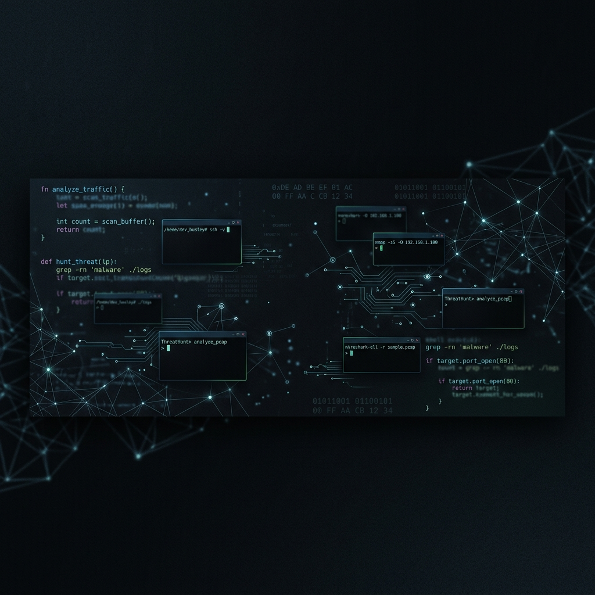
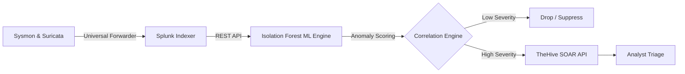

<!-- ===================== BANNER ===================== -->

  

<h1 align="center">Ankit Singh</h1>
<h3 align="center">🛡️ SOC Analyst · 🎯 Threat Hunter · ⚙️ Detection Engineer</h3>

  <em>Building end-to-end, AI-powered detection pipelines — from raw telemetry to automated SOAR response.</em>

<!-- ===================== TOP BADGES ===================== -->

  
  
  
  

  
  
  

---

## 👤 Whoami

I am a cybersecurity professional specializing in **Security Operations (SOC)**, **Threat Detection**, and **Incident Response**. I focus on moving beyond traditional, noisy signature-based alerts by building robust, end-to-end detection pipelines that leverage behavioral analytics and automation to drastically reduce alert fatigue.

> *"Security isn't just about detecting everything; it's about detecting what matters and automating the rest."*

---

## 🛠️ Technical Stack & Tools

| **Category** | **Technologies & Frameworks** |
|:---:|:---|
| 📡 **SIEM & Log Management** | `Splunk Enterprise`, `Splunk HEC`, `Elastic (ELK) Stack` |
| 🛡️ **Endpoint & Network Telemetry** | `Sysmon (SwiftOnSecurity)`, `Suricata IDS`, `Windows Event Logs` |
| 🎯 **Threat Detection & Intelligence** | `MITRE ATT&CK`, `Sigma Rules`, `Atomic Red Team`, `YARA` |
| ⚙️ **Automation & SOAR** | `TheHive`, `Python`, `PowerShell`, `Bash` |
| 🧠 **Data Analysis & ML** | `Scikit-Learn (Isolation Forest)`, `Pandas`, `NumPy` |

---

## 🏆 Featured Portfolio Projects

### 🧠 [CogniSOC: End-to-End AI-Powered SOC Architecture](https://github.com/ExelR8ight/CogniSOC)
 

My flagship project. A complete, production-ready SOC pipeline built from scratch to solve alert fatigue. 
- **The Challenge:** Traditional rule-based SIEMs generate too much noise.
- **The Solution:** An unsupervised **Isolation Forest** ML model that scores behavioral anomalies, routes them through a 6-rule MITRE ATT&CK correlation engine, and automatically escalates high-fidelity incidents to TheHive (SOAR).
- **The Result:** Achieved an **88% Precision** rate and **reduced alert volume by 75%** during a 100-hour live traffic simulation.

<b>View Architecture Flowchart</b>

### 🛡️ [ATT&CK-Mapped Detection Library](https://github.com/ExelR8ight/ATT-CK-Detection-Library)
 

A version-controlled "Detection-as-Code" repository demonstrating true detection engineering maturity. 
- Contains **13 highly tuned Sigma rules** spanning 6 MITRE ATT&CK tactics.
- Fully translated to **Splunk SPL** and **Elastic DSL**.
- Validated via **Atomic Red Team** execution.
- **Business Value:** Features rigorous "False-Positive Tuning" notes (e.g., tuning out SCCM or vulnerability scanners) to show real-world operational maturity and noise reduction.

### 🔍 [Threat Hunting & Incident Investigation Lab](https://github.com/ExelR8ight/Threat-Hunting-Lab)
 

A collection of 7 structured, end-to-end incident investigations mimicking real-world APT tradecraft (like **APT29** and **FIN7**).
- Covers PowerShell Empire C2, Data Exfiltration, Lateral Movement via PsExec, and Credential Dumping via LSASS.
- Includes structured Incident Response playbooks, extracted IOCs, and proactive threat hunting hypotheses.

---

## 🚧 Currently Building / Coming Soon

I am actively researching and building in the intersection of **Artificial Intelligence** and **Offensive Security**.

| Project | Description | Status |
|---------|-------------|:---:|
| 💉 **LogPrompt Inject** | Research and frameworks demonstrating prompt injection attacks via malicious log ingestion. |  |
| 🤖 **LLM-Assisted Alert Triage** | An automated SOC triage system using LLMs, explicitly designed and hardened to resist prompt injection from malicious logs. |  |

---

## 📊 GitHub Stats

  
  

  

