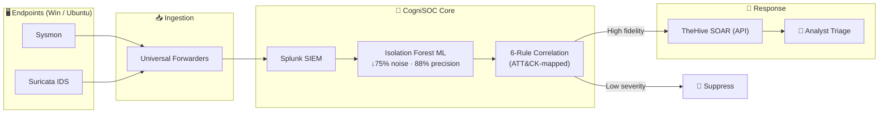

<!-- ============ ANIMATED WAVE HEADER ============ -->


<!-- ============ TYPING SUBTITLE ============ -->
<p align="center">
  <a href="https://github.com/ExelR8ight">
    
  </a>
</p>

<!-- ============ NEON CYBER LINE ============ -->


<!-- ============ BADGES + SOCIALS ============ -->
<p align="center">
  
  
  
  
</p>
<p align="center">
  <a href="https://linkedin.com/in/ankit-singh-1b0632265"></a>
  <a href="mailto:ankisinsen152@gmail.com"></a>
  
  
</p>

<!-- ============ LIVE DEV QUOTE (changes every reload) ============ -->
<p align="center">
  
</p>


## 👤 Whoami


```python
class AnkitSingh:
    def __init__(self):
        self.role        = ["SOC Analyst", "Threat Hunter", "Detection Engineer"]
        self.mission     = "Detect what matters. Automate the rest."
        self.stack       = ["Splunk", "Python", "Sigma", "TheHive", "Scikit-Learn"]
        self.researching = "LLM security & prompt-injection defense"
        self.frameworks  = "MITRE ATT&CK"

    def philosophy(self):
        return "Detection without response is just noise — I build the whole loop."
```

> *"Security isn't just about detecting everything; it's about detecting what matters and automating the rest."*

- 🔭 Building end-to-end, AI-powered detection pipelines
- 🧪 First-author research on LLM agent security in SOC triage
- 🎯 Targeting **SOC / Threat Hunting / Detection Engineering** roles
- 📜 CEH (in progress) · active on TryHackMe & Hack The Box

<br clear="right"/>


## 🧰 Technical Arsenal

<p align="center">
  
</p>

| **Category** | **Technologies & Frameworks** |
|:---:|:---|
| 📡 **SIEM & Log Mgmt** | `Splunk Enterprise` · `Splunk HEC` · `Elastic (ELK)` |
| 🛡️ **Endpoint & Network Telemetry** | `Sysmon (SwiftOnSecurity)` · `Suricata IDS` · `Windows Event Logs` |
| 🎯 **Detection & Intel** | `MITRE ATT&CK` · `Sigma` · `Atomic Red Team` · `YARA` |
| ⚙️ **Automation & SOAR** | `TheHive` · `Python` · `PowerShell` · `Bash` |
| 🧠 **Data Science & ML** | `Scikit-Learn (Isolation Forest)` · `Pandas` · `NumPy` |
| 🤖 **AI Security** | `LLM Security` · `Prompt-Injection Defense` · `Ollama` |

### 📡 Live Skills Radar

<p align="center">
  
</p>


## 🏗️ Flagship Architecture — CogniSOC Pipeline




## 🏆 Featured Portfolio Projects

> 💡 *Click each project to expand the deep-dive.*

<details open>
<summary><b>🧠 CogniSOC — End-to-End AI-Powered SOC</b> &nbsp;  </summary>
<br>

A complete, production-style SOC pipeline built from scratch to **solve alert fatigue**.
- **Challenge:** Rule-based SIEMs generate too much noise.
- **Solution:** Unsupervised **Isolation Forest** scores behavioral anomalies → **6-rule ATT&CK correlation engine** → auto-escalation to **TheHive (SOAR)** via API.
- **Result:** **88% precision** · **75% alert-volume reduction** across a 100-hour live-traffic simulation in a **4-machine isolated lab**.

🔗 **[Explore CogniSOC →](https://github.com/ExelR8ight/CogniSOC)**

</details>

<details>
<summary><b>🛡️ ATT&CK-Mapped Detection Library</b> &nbsp;  </summary>
<br>

Version-controlled **Detection-as-Code** repo proving detection-engineering maturity.
- **13 tuned Sigma rules** across **6 ATT&CK tactics**, translated to **Splunk SPL** + **Elastic DSL**.
- Every rule **validated with Atomic Red Team**.
- **False-Positive Tuning notes** (e.g., suppressing SCCM & vuln-scanner noise) — real operational maturity.

🔗 **[Explore the Library →](https://github.com/ExelR8ight/ATT-CK-Detection-Library)**

</details>

<details>
<summary><b>🔍 Threat Hunting & Incident Investigation Lab</b> &nbsp;  </summary>
<br>

**7 structured, end-to-end investigations** emulating **APT29 (Cozy Bear)** & **FIN7** tradecraft.
- PowerShell Empire C2 · Data Exfiltration · Lateral Movement (PsExec) · Credential Dumping (LSASS).
- Ships with **IR playbooks**, **extracted IOCs**, and proactive **hunt hypotheses**.

🔗 **[Explore the Hunts →](https://github.com/ExelR8ight/Threat-Hunting-Lab)**

</details>

<details>
<summary><b>💉 LogPrompt-Inject — LLM SOC Triage Vulnerabilities</b> &nbsp;  </summary>
<br>

AI-Security research, **under review at ACM AISec @ CCS**.
- **Research:** Indirect prompt-injection against LLM SOC-triage engines via malicious telemetry (Sysmon `CommandLine`, Suricata `http_user_agent`).
- **Findings:** *Defense Portability Failure* & *Defense Backfire* across **6 open-weight + 3 frontier models** — defenses that secure one model can worsen another.
- **Value:** LLM threat modeling + rigorous empirical methodology.

🔗 **[Read the Research →](https://github.com/ExelR8ight/LogPrompt-Inject)**

</details>

<details>
<summary><b>🤖 LLM-Assisted SOC Alert Triage (Injection-Hardened)</b> &nbsp;  </summary>
<br>

An AI triage **copilot** that classifies raw Sysmon/Suricata alerts and resists prompt injection.
- **Engine:** Telemetry in → strict **JSON** out (Severity · ATT&CK mapping · Next steps).
- **Security layer:** Applies my LogPrompt-Inject findings — **Spotlighting (data-marking)** + **schema validation** to neutralize injected instructions before the LLM sees them.
- **Value:** I both *find* the vuln and *engineer* the fix.

🔗 **[Explore the Copilot →](https://github.com/ExelR8ight/LLM-Assisted-Alert-Triage)**

</details>

## 🎮 Lab & Learning Stats

| Arena | Status |
|---|---|
| 🛡️ **Certifications** | `Certified Ethical Hacker (CEH) — Trained` |
| 🟩 **TryHackMe** | `SOC Analyst path — in progress` |
| 🟥 **Hack The Box** | `SOC Analyst path — in progress` |
| 🏴 **CTF** | `Web · OSINT · Networking` |

<details>
<summary>🥚 <b>psst… click for a hidden easter egg</b></summary>
<br>

```
[+] You found the buried IOC. 🕵️

[+] In a real investigation, curiosity is the best detection rule.

[+] Now go pin those repos and apply. 🚀
```

</details>


## 🐍 Live Contribution Pets

> These regenerate on their own — a self-updating snake and a 3D contribution world.

<p align="center">
  
</p>

## 📊 GitHub Analytics

<p align="center">
  
  
</p>

<p align="center">
  
</p>

<p align="center">
  
</p>


<p align="center">
  
</p>

<p align="center">
  <a href="https://linkedin.com/in/ankit-singh-1b0632265"></a>
  <a href="mailto:ankisinsen152@gmail.com"></a>
</p>


